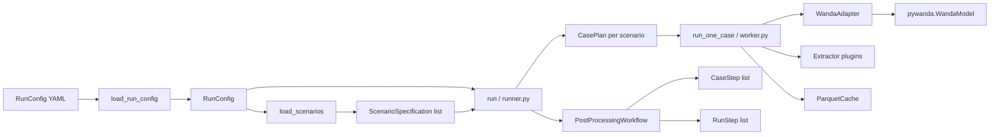

# pywandahydra

## 1. Overview

`pywandahydra` is a batch scenario runner for [WANDA](https://www.deltares.nl/software-solutions/wanda/) pipeline simulation models. It reads a matrix of parameter changes from an Excel workbook, applies each row as an independent scenario to a base WANDA model, runs steady and/or unsteady simulations in parallel, and then executes a configurable post-processing pipeline that extracts results, generates tables, and renders plots. It exists so that you can run hundreds of simulation variants without managing model copies or post-processing scripts by hand.

---

## 2. How the pieces connect

A run starts from a YAML config file that references a base model and a scenario workbook. The runner builds one `CasePlan` per included scenario, dispatches them to worker processes, and after all cases finish runs a post-processing `PostProcessingWorkflow` across the collected results.



### Entry points

**`main`** — CLI entry point registered as the `pywandahydra` console script. Delegates immediately to the Typer `app`.

**`app`** — Typer application exposing the `run`, `validate`, `status`, `plot`, and `plugins` sub-commands.

### Config layer

**`RunConfig`** — Top-level Pydantic model loaded from YAML or JSON. Holds `ModelSpecification`, `ExecutionConfig`, the path to the scenario file, and optional run-level post-processing overrides. Validated on load; extra keys are rejected.

**`ModelSpecification`** — Describes the base WANDA model: where the `.wdi` file lives, where the WANDA binaries are, simulation flags (`run_steady`, `run_unsteady`), and any `global_overrides` applied before per-scenario changes.

**`ExecutionConfig`** — Controls parallelism (`n_workers`), resume mode, and which `WorkflowSpec` to activate.

**`WorkflowSpec`** — A `{name, params}` pair selecting a registered `PostProcessingWorkflow` and passing it typed parameters.

**`RunContext`** — Lightweight struct (run ID, timestamp, output root) passed through the execution layer. Built by `build_run_context`.

**`load_run_config`** — Call this to parse a YAML/JSON file into a `RunConfig`. Use `validate_run_paths` afterward to resolve and check all filesystem paths.

### Scenario layer

**`ScenarioSpecification`** — One row from the scenario workbook: metadata (`ScenarioMeta`), a list of `ParameterChange` objects, and post-processing specs (tables, route plots, time-series plots).

**`ScenarioMeta`** — Per-scenario metadata: `name`, `number`, `include` flag, and optional description.

**`ParameterChange`** — A `(component, property, value, mode)` tuple. `mode` is `"set"` (default), `"scale"`, or `"offset"`. The special property `"disuse"` normalises legacy string/numeric values automatically via `parse_disuse_value`.

**`load_scenarios`** — Loads a scenario file by auto-detecting its extension and dispatching to the registered `ScenarioSource`. Returns a list of `ScenarioSpecification`.

**`ScenarioSource`** — Protocol for scenario loading backends. Implement this to add support for new file formats (see §4).

**`XlsScenarioSource`** — Built-in source for `.xls`, `.xlsx`, and `.xlsm` files. Reads the `Cases`, `Output`, `Rplots`, and `Tplots` sheets.

**`ScenarioLoadOptions`** — Dataclass controlling sheet names, header row positions, NaN-skip behaviour, and strict-validation mode for the XLS source.

### Execution layer

**`run`** *(runner.py)* — Orchestrates a full batch run. Builds `CasePlan` objects, optionally skips completed cases (resume mode), dispatches to `run_one_case` sequentially or via multiprocessing, then hands control to the workflow.

**`RunResult`** — Frozen dataclass returned by `run` with counts of total / selected / succeeded / failed / skipped cases.

**`CasePlan`** — All the information one worker needs to execute a single case: model spec, scenario spec, output directories, extractor specs, and a config hash for resume detection.

### Adapter layer

**`WandaAdapter`** — Protocol/abstract base wrapping `pywanda.WandaModel`.

**`apply_parameter_change`** — Applies one `ParameterChange` to an open `WandaModel`. Handles bulk selectors (`PALL` = all pipes, `CALL` = all components), the `disuse` property, and SI-to-model-unit conversion.

**`resolve_items`** — Resolves a component identifier string to one or more `WandaItemRef` objects using exact lookup, then keyword search as a fallback.

### Post-processing layer

**`PostProcessingWorkflow`** — Protocol for a configurable workflow. Returns `CaseStep` instances run per-case and `RunStep` instances run once after all cases complete.

**`CaseStep`** — Protocol for a per-scenario step. Implement `applicable(ctx)` and `run(ctx)`.

**`RunStep`** — Protocol for a run-level step. Implement `run(ctx)`.

**`Extractor`** — Protocol for custom model-level extraction plugins that run while the WANDA model is still open, before the session closes.

**`ParquetCache`** — Stores and retrieves per-case extraction results as Parquet files. Used both during execution and by the `plot` CLI command.

---

## 3. Quick-start

**Prerequisites:** WANDA installed on Windows, `pywanda` importable, and a base `.wdi` model file.

1. Create a scenario workbook (`scenarios.xlsx`) with a `Cases` sheet. The sheet must have `Number`, `Include`, and `Name` columns, followed by `(Component, Property)` column pairs for each parameter you want to vary.

2. Create a run config file (`run.yaml`). A working example is at [examples/data/run_config.yaml](../examples/data/run_config.yaml):

```yaml
run_id: my_first_run            # optional; defaults to current timestamp
output_root: ./runs             # results land under ./runs/my_first_run/

model:
  model_path: ./models/base.wdi
  wanda_bin: c:/Program Files (x86)/Deltares/Wanda 4.8/Bin64
  base_model_name: base
  run_steady: true
  run_unsteady: false

execution:
  n_workers: 4                  # 1 = sequential, >1 = multiprocessing
  resume: false                 # set true to skip already-completed cases
  workflow: default             # built-in post-processing workflow

scenario_file: ./scenarios.xlsx
```

The matching scenario workbook is at [examples/data/scenarios/cases.xls](../examples/data/scenarios/cases.xls).

3. Run the batch:

```shell
pywandahydra run run.yaml
```

> **Python API alternative:** if you prefer to drive runs from Python rather than the CLI, see [examples/run_from_config.py](../examples/run_from_config.py) (config-file driven) or [examples/run.py](../examples/run.py) (fully programmatic, building `ModelSpecification` and `RunContext` in code).

4. Check progress or re-inspect a finished run:

```shell
pywandahydra status ./runs/my_first_run
```

5. Re-render plots from cached data:

```shell
pywandahydra plot ./runs/my_first_run --format png
```

6. Validate config without running anything:

```shell
pywandahydra validate run.yaml
```

---

## 3a. Surge-vessel optimization (Zwan et al. 2012)

The `optimize` command reproduces the surge-vessel optimization routine from
*van der Zwan et al. 2012 — "Optimization of surge protection for a large water
transmission scheme in Abu Dhabi"*.

For a model containing an inclined surge vessel, it finds the **acceptable range of
C-values** (`C = p·V`, mass control) for a **varying number of surge vessels**, and
thereby the **minimum number of vessels** that still yields a feasible C-range. Two
acceptance criteria drive a bisection search per vessel count:

- minimum pipeline pressure ≥ limit, evaluated at **Laplace coefficient 1.4**;
- minimum surge-vessel water level ≥ limit, evaluated at **Laplace coefficient 1.0**.

Each evaluation is a normal single-scenario run (model copy, unsteady simulation,
extraction, caching); identical `(count, C, Laplace)` triples are reused via the
runner's resume mechanism so repeated bisection probes are not re-simulated.

Run it with a JSON config (see [examples/data/optimization_config.json](../examples/data/optimization_config.json)):

```shell
pywandahydra optimize optimization_config.json
```

Key config fields:

- `surge_vessel` — identifier/keyword of the inclined vessel component.
- `properties.number` / `properties.c_value` / `properties.laplace` — the vessel
  property names to set (defaults: `Number of vessels`, `Initial C in P*V=C`,
  `Laplace coefficient`).
- `pressure_pipes_keyword` + `pressure_property` — pipes and property to check for
  minimum pressure.
- `water_level_property` — vessel property to check for minimum water level.
- `acceptance.min_pressure` / `acceptance.min_water_level` — limits, expressed in the
  **SI units** returned by the WANDA adapter (e.g. Pa, m).
- `number_of_vessels` — `{min, max, step}` bounds to explore.
- `c_value` — `{lower, upper}` bisection bracket; `convergence` — `{rel_tol, max_iter}`
  (the paper stops at < 1 % deviation).
- `base_parameters` — parameter changes applied to every evaluation (e.g. the flow
  scenario / operating pressure).
- `unacceptable_error_patterns` — case-insensitive substrings identifying WANDA
  simulation failures that are physically meaningful **unacceptable** outcomes rather
  than fatal errors (default `["Empty"]`). For example, a large C-value can drain the
  surge vessel, which WANDA reports as `Unsteady error in physical component:
  AIRVin A1 Empty`. A matching failure is treated as **unacceptable for the water-level
  criterion** (its upper bound) but **acceptable for pressure** — draining is a
  high-C / water-level limit, not a pressure failure, so the pressure criterion stays
  monotonic in C and its lower bound is still found. The bisection continues; any
  other failure is re-raised.

Outputs land under `output_root/run_id/`:

- `optimization_results.json` and `optimization_results.csv` — per-vessel-count
  boundary C-values, feasible C-range, and feasibility;
- `figures/acceptable_c_range.png` — the acceptable-C-range vs. number-of-vessels plot
  (paper Fig. 8/9 style).

---

## 4. Adding a new integration


### 4a. Custom scenario source

**What to implement** — the `ScenarioSource` protocol from `pywandahydra.scenarios.sources.base`:

```python
from pathlib import Path
from pywandahydra.scenarios.schema import ScenarioSpecification

class MySource:
    extensions: set[str] = {".csv"}

    def load(self, path: Path) -> list[ScenarioSpecification]:
        ...
```

**Where to register it** — decorate the class with `@register_source` from `pywandahydra.scenarios.sources.base`, or use the `pywandahydra.scenario_sources` entry-point group in your package's `pyproject.toml`:

```toml
[project.entry-points."pywandahydra.scenario_sources"]
csv = "mypackage.sources:MySource"
```

**Worked example** — the built-in XLS source in [src/pywandahydra/scenarios/sources/xls.py](../src/pywandahydra/scenarios/sources/xls.py). A sample workbook that exercises the `Cases`, `Output`, `Rplots`, and `Tplots` sheets is at [examples/data/scenarios/cases.xls](../examples/data/scenarios/cases.xls).

```python
from pywandahydra.scenarios.sources.base import register_source
from pywandahydra.scenarios.schema import ScenarioSpecification

@register_source
class XlsScenarioSource:
    extensions: set[str] = {".xls", ".xlsx", ".xlsm"}

    def load(self, path) -> list[ScenarioSpecification]:
        from pywandahydra.scenarios.sources.xls import read_scenarios_from_excel
        from pywandahydra.scenarios.mapper import ScenarioLoadOptions
        return read_scenarios_from_excel(path, ScenarioLoadOptions())
```

**Checklist**
- `extensions` must be a `set[str]` with lowercase dot-prefixed extensions (e.g. `{".csv"}`).
- `load` must return `ScenarioSpecification` objects with a valid `ScenarioMeta` (at minimum `name`, `number`, `include`).
- The registry is keyed on extension; registering a duplicate extension silently replaces the earlier entry.
- Raise `ValueError` for malformed input; the runner will catch it and abort with a non-zero exit code.

---

### 4b. Custom extractor

**What to implement** — the `Extractor` protocol from `pywandahydra.postprocessing.extraction.extractors`:

```python
from typing import Any, ClassVar
from pydantic import BaseModel
from pywandahydra.postprocessing.extraction.extractors import Extractor
from pywandahydra.postprocessing.core.context import ExtractionContext

class MyExtractor:
    name: ClassVar[str] = "my_extractor"
    description: ClassVar[str] = "Extracts custom energy-loss data."

    class Params(BaseModel):
        threshold: float = 100.0

    def __init__(self, params: Params | None = None) -> None:
        self._p = params or self.Params()

    def extract(self, ctx: ExtractionContext) -> dict[str, Any]:
        # ctx.model  — open pywanda.WandaModel
        # ctx.scenario — ScenarioSpecification
        df = ...  # build a DataFrame
        return {"energy_loss": df}
```

**Where to register it** — declare an entry point in `pyproject.toml`:

```toml
[project.entry-points."pywandahydra.extractors"]
my_extractor = "mypackage.extractors:MyExtractor"
```

Then reference it in the run config:

```yaml
execution:
  extractors:
    - name: my_extractor
      params:
        threshold: 50.0
```

**Checklist**
- `name` must be a unique string; it becomes the cache key and the config name.
- `extract` is called while the model is still open — do not close it.
- Return a `dict` mapping output names to DataFrames. Empty dict is valid.
- `Params` must be a `pydantic.BaseModel`; it is validated before `__init__` is called.
- Run `pywandahydra plugins` to confirm your extractor appears in the registry after installation.

---

### 4c. Custom post-processing workflow

**What to implement** — the `PostProcessingWorkflow` protocol from `pywandahydra.postprocessing.core.protocols`:

```python
from typing import ClassVar
from pydantic import BaseModel
from pywandahydra.postprocessing.core.protocols import (
    CaseStep, PostProcessingWorkflow, RunStep
)
from pywandahydra.postprocessing.core.context import CaseContext, PostProcessingRunContext

class MyWorkflow:
    name: ClassVar[str] = "my_workflow"
    description: ClassVar[str] = "Minimal custom workflow."

    class Params(BaseModel):
        pass

    def __init__(self, params: Params) -> None:
        self._p = params

    def case_steps(self, ctx: CaseContext) -> list[CaseStep]:
        return []   # return step instances to run per case

    def run_steps(self, ctx: PostProcessingRunContext) -> list[RunStep]:
        return []   # return step instances to run once after all cases
```

**Where to register it** — use `register_workflow` from `pywandahydra.postprocessing.workflows.base` or the `pywandahydra.workflows` entry-point group. Activate it by setting `execution.workflow: my_workflow` in the run config.

**Checklist**
- Both `case_steps` and `run_steps` must return lists (empty is valid).
- `Params` must be a `pydantic.BaseModel` with defaults for all fields, or validation will fail at startup.
- `CaseStep.applicable(ctx)` is called before `run(ctx)`; return `False` to skip the step for a given case.
- Exceptions inside steps are logged and swallowed; the run continues.

---

## 5. Reference

### Functions

| Export | Kind | Description |
|--------|------|-------------|
| `apply_parameter_change` | function | Applies a `ParameterChange` to an open `WandaModel`, handling bulk selectors, disuse, and unit conversion. |
| `apply_post_processing_overrides` | function | Merges run-level post-processing config (e.g. theme) into each `ScenarioSpecification` in place. |
| `bootstrap` *(extractors)* | function | Loads all `pywandahydra.extractors` entry points and registers them; idempotent. |
| `bootstrap` *(workflows)* | function | Loads all `pywandahydra.workflows` entry points and registers them; idempotent. |
| `build_run_context` | function | Creates a `RunContext` from a `RunConfig`, computing the output root directory. |
| `config_hash` | function | Returns a deterministic `sha256:…` hash of a `RunConfig` for resume-mode comparison. |
| `find_items_with_keyword` | function | Searches all components, nodes, and signal lines in a model for a keyword, returning `WandaItemRef` list. |
| `get_extractor_class` | function | Looks up a registered `Extractor` class by name; raises `KeyError` if not found. |
| `get_source_for_extension` | function | Returns the `ScenarioSource` class registered for a file extension; raises `ValueError` if unsupported. |
| `get_workflow_class` | function | Looks up a registered `PostProcessingWorkflow` class by name. |
| `list_extractors` | function | Returns a sorted list of registered extractor names. |
| `list_source_extensions` | function | Returns a sorted list of all registered scenario file extensions. |
| `list_workflows` | function | Returns a sorted list of registered workflow names. |
| `load_run_config` | function | Parses a YAML or JSON file into a validated `RunConfig`. |
| `load_scenarios` | function | Loads a scenario file via the appropriate registered `ScenarioSource`. |
| `main` | function | CLI entry point; invokes the Typer `app`. |
| `parse_disuse_value` | function | Normalises legacy disuse values (strings, ints, floats) to the boolean expected by WANDA. |
| `register_extractor` | function | Registers an `Extractor` class under its `name`; returns the class unchanged. |
| `register_source` | function | Registers a `ScenarioSource` class for each extension in `extensions`; usable as a decorator. |
| `register_workflow` | function | Registers a `PostProcessingWorkflow` class under its `name`. |
| `resolve_extractor` | function | Instantiates a registered extractor with validated params. |
| `resolve_items` | function | Resolves a component identifier to `WandaItemRef` objects via exact match, then keyword fallback. |
| `resolve_route_pipes` | function | Returns `(pipe_name, direction)` tuples for all pipes on a named route. |
| `resolve_workflow` | function | Instantiates a registered workflow with validated params. |
| `run` *(runner)* | function | Orchestrates a full batch run: builds plans, dispatches workers, aggregates results, runs workflow. |
| `setup_logging` | function | Configures the root logger with a timestamp format; call once per process. |
| `validate_run_paths` | function | Validates and resolves all filesystem paths in a `RunConfig` in place; raises `ValueError` on any problem. |

### Classes

| Export | Kind | Description |
|--------|------|-------------|
| `AnalysisMeta` | class | Pydantic model for run-level metadata read from the scenario workbook (description, WANDA version, project number). |
| `CasePlan` | class | Frozen dataclass holding everything one worker needs to execute one scenario case. |
| `ExecutionConfig` | class | Pydantic model controlling parallelism, resume mode, and workflow selection. |
| `ModelSpecification` | class | Pydantic model describing the base WANDA model: paths, simulation flags, and global overrides. |
| `ParameterChange` | class | Pydantic model for a single `(component, property, value, mode)` change to apply to the model. |
| `PostProcessingRunConfig` | class | Pydantic model for run-level post-processing overrides (currently `theme`). |
| `RunConfig` | class | Top-level Pydantic model combining all settings for one batch run. |
| `RunContext` | class | Pydantic model carrying the run ID, timestamp, and output root directory through the execution layer. |
| `RunMetadata` | class | Auto-captured snapshot of environment metadata (hostname, OS, Python version) written to `run_metadata.json`. |
| `RunResult` | class | Frozen dataclass returned by `run()` with success / failure / skip counts and per-case results. |
| `ScenarioLoadOptions` | class | Frozen dataclass controlling how the XLS source reads the scenario workbook (sheet names, header rows, strict mode). |
| `ScenarioMeta` | class | Pydantic model for per-scenario metadata: `name`, `number`, `include`, and optional description. |
| `ScenarioSpecification` | class | Pydantic model for one complete scenario: metadata, parameter changes, and post-processing specs. |
| `WandaItemRef` | class | Frozen dataclass identifying one item in a WANDA model by name and type (`component`, `node`, or `signal_line`). |
| `WorkflowSpec` | class | Pydantic model pairing a workflow name with its parameter dict. |
| `XlsScenarioSource` | class | Built-in `ScenarioSource` for `.xls`, `.xlsx`, and `.xlsm` workbooks. |

### Protocols / interfaces

| Export | Kind | Description |
|--------|------|-------------|
| `CaseStep` | protocol | Per-scenario post-processing step: implement `applicable(ctx)` and `run(ctx)`. |
| `Extractor` | protocol | Custom model-level extraction plugin: implement `extract(ctx) -> dict`. |
| `PostProcessingWorkflow` | protocol | Configurable workflow returning `CaseStep` and `RunStep` lists. |
| `RunStep` | protocol | Run-level post-processing step: implement `run(ctx)`. |
| `ScenarioSource` | protocol | Scenario loading backend: implement `extensions` and `load(path)`. |

### Types / literals

| Export | Kind | Description |
|--------|------|-------------|
| `ChangeMode` | type | Literal `"set" \| "scale" \| "offset"` — how a `ParameterChange` is applied. |
| `ItemType` | type | Literal `"component" \| "node" \| "signal_line"` — WANDA item kind used in `WandaItemRef`. |
