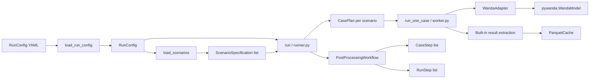

# pywandahydra

## 1. Overview

`pywandahydra` is a batch scenario runner for [WANDA](https://www.deltares.nl/software-solutions/wanda/) pipeline simulation models. It reads a matrix of parameter changes from an Excel workbook, applies each row as an independent scenario to a base WANDA model, runs steady and/or unsteady simulations in parallel, and then executes a configurable post-processing pipeline that extracts results, generates tables, and renders plots. It exists so that you can run hundreds of simulation variants without managing model copies or post-processing scripts by hand.

---

## 2. How the pieces connect

A run starts from a YAML config file that references a base model and a scenario workbook. The runner builds one `CasePlan` per included scenario, dispatches them to worker processes, and after all cases finish runs a post-processing `PostProcessingWorkflow` across the collected results.



### Command-line interface

**`main`** — CLI entry point registered as the `pywandahydra` console script. Delegates immediately to the Typer `app`.

**`app`** — Typer application exposing the `run`, `validate`, `status`, and `plot` sub-commands.

### Config layer

**`RunConfig`** — Top-level Pydantic model loaded from YAML or JSON. Holds `ModelSpecification`, `ExecutionConfig`, the path to the scenario file, and optional run-level post-processing overrides. Validated on load; extra keys are rejected.

**`ModelSpecification`** — Describes the base WANDA model: where the `.wdi` file lives, where the WANDA binaries are, and simulation flags (`run_steady`, `run_unsteady`).

**`ExecutionConfig`** — Controls parallelism (`n_workers`), resume mode, and which `WorkflowSpec` to activate.

**`WorkflowSpec`** — A `{name, params}` pair selecting a registered `PostProcessingWorkflow` and passing it typed parameters.

**`RunContext`** — Lightweight struct (run ID, timestamp, output root) passed through the execution layer. Built by `build_run_context`.

**`load_run_config`** — Call this to parse a YAML/JSON file into a `RunConfig`. Use `validate_run_paths` afterward to resolve and check all filesystem paths.

### Scenario layer

**`ScenarioSpecification`** — One row from the scenario workbook: flat identity (`number`, `include`, `name`), a list of `ModelParameterChange` objects, and post-processing specs (tables, route plots, time-series plots).

**`ModelParameterChange`** — A `(component, property, value)` change. The special property `"disuse"` normalises legacy string/numeric values automatically via `parse_disuse_value`.

**`load_scenarios`** — Loads a scenario file by auto-detecting its extension and dispatching to the registered `ScenarioSource`. Returns a list of `ScenarioSpecification`.

**`ScenarioSource`** — Protocol implemented by the bundled scenario loading backends.

**`XlsScenarioSource`** — Built-in source for `.xls`, `.xlsx`, and `.xlsm` files. Reads the `Cases`, `Output`, `Rplots`, and `Tplots` sheets.

**`ScenarioLoadOptions`** — Dataclass controlling sheet names, header row positions, NaN-skip behaviour, and strict-validation mode for the XLS source.

### Execution layer

**`run`** *(runner.py)* — Orchestrates a full batch run. Builds `CasePlan` objects, optionally skips completed cases (resume mode), dispatches to `run_one_case` sequentially or via multiprocessing, then hands control to the workflow.

**`RunResult`** — Frozen dataclass returned by `run` with counts of total / selected / succeeded / failed / skipped cases.

**`CasePlan`** — All the information one worker needs to execute a single case: model spec, scenario spec, output directories, workflow selection, and a config hash for resume detection.

### Adapter layer

**`WandaAdapter`** — Protocol/abstract base wrapping `pywanda.WandaModel`.

**`apply_parameter_change`** — Applies one `ModelParameterChange` to an open `WandaModel`. Handles bulk selectors (`PALL` = all pipes, `CALL` = all components), the `disuse` property, and SI-to-model-unit conversion.

**`resolve_items`** — Resolves a component identifier string to one or more `WandaItemRef` objects using exact lookup, then keyword search as a fallback.

### Post-processing layer

**`PostProcessingWorkflow`** — Protocol for a configurable workflow. Returns `CaseStep` instances run per-case and `RunStep` instances run once after all cases complete.

**`CaseStep`** — Protocol for a per-scenario step. Implement `applicable(ctx)` and `run(ctx)`.

**`RunStep`** — Protocol for a run-level step. Implement `run(ctx)`.

**`ParquetCache`** — Stores and retrieves per-case extraction results as Parquet files. Used both during execution and by the `plot` CLI command.

---

## 3. Quick-start

**Prerequisites:** WANDA installed on Windows, `pywanda` importable, and a base `.wdi` model file.

1. Create a scenario workbook (`scenarios.xlsx`) with a `Cases` sheet. The sheet must have `Number`, `Include`, and `Name` columns, followed by `(Component, Property)` column pairs for each parameter you want to vary.

2. Create a run config file (`run.yaml`). A working example is at [examples/data/run_config.yaml](../examples/data/run_config.yaml):

```yaml
run_id: my_first_run            # optional; defaults to current timestamp
output_root: ./runs             # results land under ./runs/my_first_run/

model:
  model_path: ./models/base.wdi
  wanda_bin: c:/Program Files (x86)/Deltares/Wanda 4.8/Bin64
  base_model_name: base
  run_steady: true
  run_unsteady: false

execution:
  n_workers: 4                  # 1 = sequential, >1 = multiprocessing
  resume: false                 # set true to skip already-completed cases
  workflow: default             # built-in post-processing workflow

scenario_file: ./scenarios.xlsx
```

The matching scenario workbook is at [examples/data/scenarios/cases.xls](../examples/data/scenarios/cases.xls).

3. Run the batch:

```shell
pywandahydra run run.yaml
```

> **Python API alternative:** if you prefer to drive runs from Python rather than the CLI, see [examples/run_from_config.py](../examples/run_from_config.py) (config-file driven) or [examples/run.py](../examples/run.py) (fully programmatic, building `ModelSpecification` and `RunContext` in code).

4. Check progress or re-inspect a finished run:

```shell
pywandahydra status ./runs/my_first_run
```

5. Re-render plots from cached data:

```shell
pywandahydra plot ./runs/my_first_run --format png
```

6. Validate config without running anything:

```shell
pywandahydra validate run.yaml
```

---

## 4. Extending pywandahydra

pywandahydra does not discover extensions from separately installed packages. Scenario loading, result extraction, and post-processing capabilities are bundled with the application so that a run has deterministic behavior for a given pywandahydra version.

New capabilities are normal source changes to this repository and ship in a pywandahydra release:

- Add scenario formats alongside the built-in sources in `src/pywandahydra/scenarios/sources` and cover loading and validation with tests.
- Add data required by reports to the built-in extraction path in `src/pywandahydra/postprocessing/extraction`, including its durable Parquet representation.
- Add post-processing behavior alongside the bundled workflows and steps in `src/pywandahydra/postprocessing`, with focused tests for generated tables or figures.

There are no `pywandahydra.*` plugin entry-point groups or runtime registration contract for third-party packages.

---

## 5. Reference

### Functions

| Export | Kind | Description |
|--------|------|-------------|
| `apply_parameter_change` | function | Applies a `ModelParameterChange` to an open `WandaModel`, handling bulk selectors, disuse, and unit conversion. |
| `apply_post_processing_overrides` | function | Merges run-level post-processing config (e.g. theme) into each `ScenarioSpecification` in place. |
| `bootstrap` *(workflows)* | function | Registers the workflows bundled with pywandahydra; idempotent. |
| `build_run_context` | function | Creates a `RunContext` from a `RunConfig`, computing the output root directory. |
| `config_hash` | function | Returns a deterministic `sha256:…` hash of a `RunConfig` for resume-mode comparison. |
| `find_items_with_keyword` | function | Searches all components, nodes, and signal lines in a model for a keyword, returning `WandaItemRef` list. |
| `get_source_for_extension` | function | Returns the bundled `ScenarioSource` class registered for a file extension; raises `ValueError` if unsupported. |
| `get_workflow_class` | function | Looks up a bundled `PostProcessingWorkflow` class by name. |
| `list_source_extensions` | function | Returns a sorted list of all registered scenario file extensions. |
| `list_workflows` | function | Returns a sorted list of bundled workflow names. |
| `load_run_config` | function | Parses a YAML or JSON file into a validated `RunConfig`. |
| `load_scenarios` | function | Loads a scenario file via the appropriate registered `ScenarioSource`. |
| `main` | function | CLI entry point; invokes the Typer `app`. |
| `parse_disuse_value` | function | Normalises legacy disuse values (strings, ints, floats) to the boolean expected by WANDA. |
| `register_source` | function | Internal decorator used to register a bundled `ScenarioSource`. |
| `register_workflow` | function | Internal helper used to register a bundled `PostProcessingWorkflow`. |
| `resolve_items` | function | Resolves a component identifier to `WandaItemRef` objects via exact match, then keyword fallback. |
| `resolve_route_pipes` | function | Returns `(pipe_name, direction)` tuples for all pipes on a named route. |
| `resolve_workflow` | function | Instantiates a bundled workflow with validated params. |
| `run` *(runner)* | function | Orchestrates a full batch run: builds plans, dispatches workers, aggregates results, runs workflow. |
| `setup_logging` | function | Configures the root logger with a timestamp format; call once per process. |
| `validate_run_paths` | function | Validates and resolves all filesystem paths in a `RunConfig` in place; raises `ValueError` on any problem. |

### Classes

| Export | Kind | Description |
|--------|------|-------------|
| `AnalysisMeta` | class | Pydantic model for run-level metadata read from the scenario workbook (description, WANDA version, project number). |
| `CasePlan` | class | Frozen dataclass holding everything one worker needs to execute one scenario case. |
| `ExecutionConfig` | class | Pydantic model controlling parallelism, resume mode, and workflow selection. |
| `ModelSpecification` | class | Pydantic model describing the base WANDA model: paths and simulation flags. |
| `ModelParameterChange` | class | Pydantic model for a single `(component, property, value)` change to apply to the model. |
| `PostProcessingRunConfig` | class | Pydantic model for run-level post-processing overrides (currently `theme`). |
| `RunConfig` | class | Top-level Pydantic model combining all settings for one batch run. |
| `RunContext` | class | Pydantic model carrying the run ID, timestamp, and output root directory through the execution layer. |
| `RunMetadata` | class | Auto-captured snapshot of environment metadata (hostname, OS, Python version) written to `run_metadata.json`. |
| `RunResult` | class | Frozen dataclass returned by `run()` with success / failure / skip counts and per-case results. |
| `ScenarioLoadOptions` | class | Frozen dataclass controlling how the XLS source reads the scenario workbook (sheet names, header rows, strict mode). |
| `ScenarioSpecification` | class | Pydantic model for one complete scenario: flat identity, parameter changes, and post-processing specs. |
| `WandaItemRef` | class | Frozen dataclass identifying one item in a WANDA model by name and type (`component`, `node`, or `signal_line`). |
| `WorkflowSpec` | class | Pydantic model pairing a workflow name with its parameter dict. |
| `XlsScenarioSource` | class | Built-in `ScenarioSource` for `.xls`, `.xlsx`, and `.xlsm` workbooks. |

### Protocols / interfaces

| Export | Kind | Description |
|--------|------|-------------|
| `CaseStep` | protocol | Per-scenario post-processing step: implement `applicable(ctx)` and `run(ctx)`. |
| `PostProcessingWorkflow` | protocol | Interface implemented by bundled workflows that return `CaseStep` and `RunStep` lists. |
| `RunStep` | protocol | Run-level post-processing step: implement `run(ctx)`. |
| `ScenarioSource` | protocol | Interface implemented by bundled scenario loaders. |

### Types / literals

| Export | Kind | Description |
|--------|------|-------------|
| `ItemType` | type | Literal `"component" \| "node" \| "signal_line"` — WANDA item kind used in `WandaItemRef`. |
