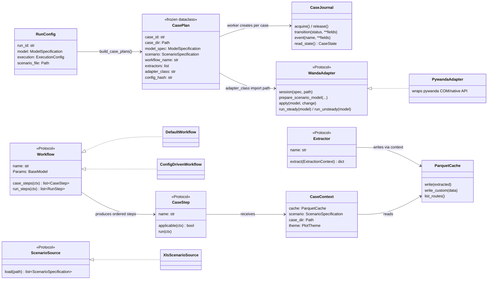

# Component architecture — how the pieces interlink

This document shows how the main components of `pywandahydra` connect: which
packages depend on which, which objects are created where, and what the
lifecycle of a single run looks like. It complements the auto-generated
module-import graphs ([package_connections.svg](package_connections.svg) and
[package_connections_interactive.html](package_connections_interactive.html)),
which show *every* import edge — here we focus on the picture a user or new
developer needs.

> The Mermaid diagrams below render directly on GitHub and in VS Code
> (with the built-in Markdown preview).

---

## 1. Layered package overview

The codebase is organized in layers. Arrows mean "uses / depends on".
Lower layers never import from the layers above them.

```mermaid
flowchart TB
    subgraph entry ["Entry points"]
        CLI["cli.commands<br/>(typer app: run / status / validate / plugins / plot)"]
    end

    subgraph orchestration ["Orchestration"]
        RUNNER["execution.runner<br/>run() — dispatch + aggregate"]
        WORKER["execution.worker<br/>run_one_case() — one case, one process"]
        PLAN["execution.case_plan<br/>CasePlan (frozen dataclass)"]
        JOURNAL["execution.journal<br/>CaseJournal (state.json + events.jsonl + lock)"]
        ARTIFACTS["execution.artifacts<br/>run directories + run log"]
    end

    subgraph inputs ["Input loading"]
        CONFIG["config.loader<br/>RunConfig, ExecutionConfig, RunMetadata"]
        MODELS["config.models<br/>ModelSpecification, RunContext"]
        SCEN["scenarios.mapper + sources<br/>load_scenarios() → ScenarioSpecification"]
        SCHEMA["scenarios.schema<br/>ScenarioSpecification, ParameterChange,<br/>PostProcessingConfig, RoutePlotSpecification"]
    end

    subgraph wanda ["WANDA integration"]
        ADAPTER["wanda.adapter<br/>WandaAdapter (Protocol)"]
        PYWADAPTER["wanda.pywanda_adapter<br/>PywandaAdapter (concrete)"]
        SESSION["wanda.session<br/>wanda_session() context manager"]
        VALID["wanda.validation<br/>preflight checks"]
    end

    subgraph post ["Post-processing"]
        PIPE["postprocessing.pipeline<br/>run_postprocessing()"]
        METH["postprocessing.workflows<br/>registry + DefaultWorkflow / ConfigDrivenWorkflow"]
        STEPS["postprocessing.steps<br/>RoutePlotStep, SummaryTableStep,<br/>AggregateTablesStep, MergePdfsStep"]
        EXTR["postprocessing.extract + extractors<br/>extract_all() + Extractor plugins"]
        CACHE["postprocessing.cache<br/>ParquetCache"]
        CTX["postprocessing.context<br/>CaseContext, PostProcessingRunContext, ExtractionContext"]
        PLOT["postprocessing.plotting<br/>renderer, themes, styles"]
    end

    CLI --> CONFIG
    CLI --> SCEN
    CLI --> VALID
    CLI --> RUNNER
    CLI --> CACHE
    CLI --> PLOT

    RUNNER --> PLAN
    RUNNER --> WORKER
    RUNNER --> JOURNAL
    RUNNER --> ARTIFACTS
    RUNNER --> METH

    WORKER --> JOURNAL
    WORKER --> PYWADAPTER
    WORKER --> EXTR
    WORKER --> CACHE
    WORKER --> PIPE

    PIPE --> METH
    METH --> STEPS
    STEPS --> CTX
    STEPS --> PLOT
    EXTR --> CTX

    PYWADAPTER -. implements .-> ADAPTER
    PYWADAPTER --> SESSION

    CONFIG --> MODELS
    SCEN --> SCHEMA
    PLAN --> MODELS
    PLAN --> SCHEMA
```



Key observations:

- **`scenarios.schema` and `config.models` are the shared vocabulary.**
  Almost every package depends on them; they depend on nothing above them.
- **The worker is the only place WANDA is touched.** Everything else works
  with plain data (Pydantic models, dataclasses, Parquet files).
- **Post-processing never needs WANDA.** Steps read from the `ParquetCache`,
  which is why `pywandahydra plot` can re-render figures offline.

---

## 2. Object creation — who creates what

This is the answer to "where does this object come from?". Solid arrows mean
*creates an instance of*; dashed arrows mean *passes it along*.

```mermaid
flowchart LR
    USER(["User<br/>config.yaml + scenarios.xlsx"])

    subgraph cli_proc ["CLI process — cli.commands.run()"]
        RC["RunConfig<br/><i>load_run_config()</i>"]
        SS["list[ScenarioSpecification]<br/><i>load_scenarios()</i>"]
        RCTX["RunContext<br/><i>build_run_context()</i>"]
        RM["RunMetadata<br/>→ run_metadata.json"]
    end

    subgraph runner_fn ["execution.runner.run()"]
        M["Workflow instance<br/><i>resolve_workflow()</i>"]
        CP["list[CasePlan]<br/><i>build_case_plans()</i><br/>one per included scenario"]
        RSC["PostProcessingRunContext<br/>(after all cases finish)"]
        RR["RunResult"]
    end

    subgraph worker_proc ["Worker process (×N) — worker.run_one_case(plan)"]
        J["CaseJournal(plan.case_dir)"]
        AD["PywandaAdapter<br/><i>_load_adapter()</i> via import path"]
        WM["pywanda.WandaModel<br/><i>adapter.session()</i> ctx manager"]
        EC["ExtractionContext<br/>per custom Extractor"]
        PC["ParquetCache(plan.case_dir)"]
        CC["CaseContext<br/>(cache + scenario + theme)"]
        ST["Case steps<br/><i>workflow.case_steps(ctx)</i>"]
    end

    USER --> RC
    USER --> SS
    RC --> RCTX
    RC -.->|model spec, execution settings| CP
    SS -.->|included scenarios| CP
    RCTX -.->|run_root| CP

    CP -->|"pickled to pool<br/>(multiprocessing spawn)"| J
    CP --> AD
    AD --> WM
    WM -.-> EC
    PC -.-> EC
    PC --> CC
    CC --> ST

    M -.->|name + params travel<br/>inside CasePlan| ST
    RSC --> RR
```



The crucial design point: **`CasePlan` is the only thing that crosses the
process boundary.** It is a frozen, fully serializable dataclass containing
the model spec, the scenario, workflow name/params, extractor specs, and
the adapter import path. Each worker process re-creates everything else
(journal, adapter, WANDA session, cache, contexts) locally from that plan.
That is also why `run_one_case` calls `bootstrap_workflows()` /
`bootstrap_extractors()` itself — registry side effects don't survive the
`spawn` boundary.

---

## 3. Lifecycle of one run (sequence)

```mermaid
sequenceDiagram
    actor U as User
    participant CLI as cli.commands.run
    participant L as config.loader
    participant S as scenarios.mapper
    participant R as execution.runner
    participant W as worker (process)
    participant A as PywandaAdapter
    participant WANDA as pywanda.WandaModel
    participant C as ParquetCache
    participant P as postprocessing

    U->>CLI: pywandahydra run config.yaml
    CLI->>L: load_run_config → RunConfig
    CLI->>L: validate_run_paths
    CLI->>S: load_scenarios → [ScenarioSpecification]
    CLI->>CLI: assert_preflight_valid (wanda.validation)
    CLI->>L: build_run_context → RunContext
    CLI->>R: run(model, ctx, scenarios, …)

    R->>R: resolve_workflow(name, params)
    R->>R: build_case_plans → [CasePlan]
    R->>W: run_one_case(plan)  ×N workers (Pool.map)

    activate W
    W->>W: CaseJournal.acquire() (file lock)
    W->>W: journal.transition(RUNNING)
    W->>A: _load_adapter(plan)
    W->>A: prepare_scenario_model (copy base model)
    A->>WANDA: session(spec, path) — open model
    W->>A: apply(global overrides + scenario parameters)
    W->>A: run_steady / run_unsteady
    W->>P: extract_all + custom Extractors (model still open)
    A->>WANDA: close session
    W->>C: cache.write(extracted) → Parquet
    W->>P: run_postprocessing(CaseContext)
    P->>P: workflow.case_steps → step.run(ctx)
    W->>W: journal.transition(SUCCEEDED / FAILED)
    deactivate W

    W-->>R: result dict per case
    R->>P: workflow.run_steps(PostProcessingRunContext)
    R-->>CLI: RunResult
    CLI-->>U: summary (succeeded / failed / skipped)
```



---

## 4. Key classes and extension points



### Extension points (all registry-based, resolved by name at runtime)

| Extension point | Protocol | Register via | Resolved in |
| --- | --- | --- | --- |
| Scenario file format | `ScenarioSource` | `@register_source` (`scenarios.sources`) | `load_scenarios()` picks by file extension |
| WANDA backend | `WandaAdapter` | config `adapter_class: "pkg.module:Class"` | `worker._load_adapter()` |
| Result extraction | `Extractor` | `@register_extractor` (`postprocessing.extractors`) | worker, while the model is open |
| Post-processing recipe | `Workflow` | `@register_workflow` | `resolve_workflow()` in runner & pipeline |
| Individual steps | `CaseStep` / `RunStep` | `@register_case_step` / `@register_run_step` | `ConfigDrivenWorkflow` builds from `StepSpec` lists |
| Plot styling | theme name | `theme_registry.bootstrap()` registry | `get_theme()` in worker |

Run `pywandahydra plugins` to list everything currently registered.

---

## 5. Output directory anatomy

Objects above map directly onto what lands on disk:

```text
<output_root>/<run_id>/                  ← RunContext.root_dir
├── run_metadata.json                    ← RunMetadata (CLI)
├── logs/<run_id>_log_<ts>.json          ← write_run_log (runner)
├── figures/  tables/                    ← run-level steps (AggregateTables, …)
└── scenarios/
    └── <case_id>/                       ← CasePlan.case_dir
        ├── <case>.wdi/.wdx              ← prepare_scenario_model (adapter)
        ├── state.json + events.jsonl    ← CaseJournal
        ├── components.parquet           ← ParquetCache
        ├── routes/<route>/*.parquet     ← ParquetCache (timeseries/envelope/profile)
        ├── post_process.json            ← post-processing spec snapshot
        └── figures/…                    ← plotting steps / `plot` command
```


